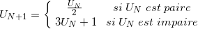

Dans ce premier TD d’introduction, nous commençons par entrer quelques expressions _Scala_ simples pour nous familiariser avec le language. 

Dans un second temps , nous nous intéressons au calcul des termes de suites récurrentes simple, Syracuse et Fibonacci. 

Liens utiles: 
* Essayez Scala dans votre Browser
  * [scalafiddle.io](https://scalafiddle.io/sf/gKgxQY0/1)
  * [scastie.org](http://scastie.org/)
* [First Steps to Scala (www.artima.com)](http://www.artima.com/scalazine/articles/steps.html)
* [scala-lang.org](http://www.scala-lang.org)


# 1 Premières expressions Scala

## Expressions 
Saisissez par exemple 2 + 3 et validez par entrée. Scala vous répond 
>```scala
> Res0: Int = 5 
>```
Ce qui signifie que vous avez entré une valeur, qui est de type entier et qui vaut 5. On peut écrire des expressions plus compliquées, _Scala_ respecte les priorités habituelles des opérateurs. 
Essayez par exemple : 
* (11 + 4) * 3 + 2 + 6 * 2 / 3
* 23 / 3
* 23 % 3   // Reste de la division entière
* 23 / 3.0

## Variables
De même qu’en mathématiques on écrit « soit s la somme des nombres 1, 2 et 3 », on écrit en Scala 
>```scala
>var S = 1 + 2 + 3 
>``` 
Scala vous répond que vous venez de définir une variable `S` qui est un entier (Int) et qui vaut 6. Vous pouvez maintenant utiliser s dans toutes vos expressions. 
Essayez par exemple :
* (2 + s ) * s + 3  
* var p = 2 * s + s * s

Les définitions de noms que nous venons de voir sont permanentes : elles restent valides tant que vous n’abandonnez pas le système _Scala_. On dit qu’elles sont globales. 
On peut aussi définir **des constantes**, ce sont des **variables immuables**.
Essayez par exemple :
* val constante = 17
* constante = 12 // ceci produit une erreur car on essaie de modifier une variable déclarée par "val"
* p = 17 (p n’est pas une constante)

## Types de base
_Scala_ a un ensemble de types de bases prédéfinis. il sont résumer dans ce qui suit :

Nom     | Definition 
---     | --- 
Byte    |  entier 8-bit signé en complément à 2 (-128 à 127)
short   |  entier 16-bit signé en complément à 2 (-32 768 à 32 767)
Int     |  entier 32-bit signé en complément à 2 (-2 147 483 648 à 2 147 483 647)
Long    |  entier 64-bit signé en complément à 2 (-2^63 à 2 2^63 -1)
Float   |  flottant 32-bit IEEE 754 en précision simple
Double  |  flottant 64-bit IEEE 754 en précision double
char    |  caractère Unicode 16-bit non signé
String  |  chaîne de Caractères unicode
Boolean |  true/false

Le type **Unit** est utilisé pour désigner les fonctions qui n'ont pas de valeur de retour. C'est l'équivalent du type void en Java. Par défaut, toutes les fonctions scala retournent le type Unit.

##  Fonctions
 Le Hello World
> ```scala
> def hello():Unit =
> {
>    println("Hello, world!")
> }
> ```
qui a pour signature `hello() (): Unit` ce qui signifie que 
 * elle a pour non hello
 * le **()** signifie qu'elle ne prend aucun parametre en entrée 
 * le **Unit** signifie qu'elle ne renvoie rien

La syntaxe des fonctions en _Scala_ est proche de la notation mathématique habituelle. 
Pour définir une fonction carre qui calcule le carré d’un réel x, on peut principalement utiliser l’écriture suivante :
> ```scala
> def carre(x :Int) :Int = x*x 
> ```
Qui a pour signature `carre(x: Int): Int`


Après avoir défini cette fonction, il vous suffit d’entrer `carre(11) `
pour calculer le carré  de 11 qui a pour valeur 121. On définit très souvent en _Scala_ des fonctions de manière récursive. Par exemple, on peut écrire une fonction qui, étant donnés deux entiers x et n, calcule  de manière récursive. Voici 2 syntaxes possibles :
>```scala
>def puissance(x:Int,n:Int):Int = 
>{
>    if (n == 1) 
>        x 
>    else 
>        x*puissance(x,(n-1))
>}
>```
solution utilisant le [**Pattern matching (link)**](http://fr.wikipedia.org/wiki/Filtrage_par_motif)

 Filtrage par motif:
 Le filtrage par motif est la vérification de la présence de constituants d'un motif par un programme informatique, ou parfois par un matériel spécialisé.
Par contraste avec la reconnaissance de forme, les motifs sont complètement spécifiés. 
 De tels motifs concernent conventionnellement des séquences ou des arbres.

>```scala
>def puissance2(x:Int,n:Int):Int = 
>{
>    n match 
>    {
>        case 1 => x
>        case _ => x*puissance2(x,(n-1))
>    }
>}
>```
Pour calculer 2^10, il suffit alors d’entrer `puissance(2,10)`
 
## **Question 1.1**
 * Combien de multiplications effectue t-on pour calculer  en utilisant cette méthode ?
 	n-1 multiplications
 * Connaissez-vous une autre méthode de calcul plus efficace?
 	exponentiation rapide
 * Implémenter celle-ci ( [aide (link)](http://fr.wikipedia.org/wiki/Exponentiation_rapide) )
>```
>def puissance3(x:Int,n:Int):Int = 
>	{
>	   if (n==1) {
>	     return x
>	   } else if (n % 2 == 0) {
>	     return puissance3(x*x, n/2)
>	   } else {
>	     return x*puissance3(x*x, (n-1)/2)
>	   }
>	}
>```

## Fonction anonyme
Avantage : notation plus courte, idéal pour les fonctions à usage unique
pour créer une fonction anonyme

>```scala
>(x: Int) => x + 1 // This function adds 1 to an Int named x.
>res1: (Int) => Int = <function1>
>
>scala> res1(1)
>res2: Int = 2
>```
il est aussi possible de créer une fonction avec plusieurs paramètres
>```scala
>    (x: Int, y: Int) => "(" + x + ", " + y + ")"
>```
ou sans paramètre 
>```scala
>    () => { System.getProperty("user.dir") }    
>```
## Les fonctions d’ordre supérieur

Une fonction d’ordre supérieur est une fonction qui a au moins l’une des deux caractéristiques suivantes :
* prend en paramètre une ou plusieurs fonctions
* sa valeur de retour est une fonction

Les fonctions d’ordre supérieur aident à l’expressivité du code en mettant l’attention sur la tâche à accomplir plutôt que sur la façon de l’accomplir, le code dévient ainsi plus déclaratif.
>```scala
>def display(name : String):Unit =
>{
>	println(name)
>}
>
>def doSomeThingWith(name : String , action : String => Unit ):Unit=
>{
>	action(name)
>}
>
>doSomeThingWith("Raoul", display)
>```
Le programme show affiche une liste de nombres sur la console :
>```scala
>def show(xs: List[Int]):Unit= {
>  for (x <- xs) {
>    println(x)
>  }
>}
>```
Le programme showSquares affiche les carrés d’une liste de nombres sur la console :
>```scala
>def showSquares(xs: List[Int]):Unit = {
>  for (x <- xs) {
>    println(x * x)
>  }
>}
>```
Observez comme les programmes show et showSquares sont similaires : leur seule différence réside dans la façon dont le nombre va être transformé avant d’être affiché. Peut-on factoriser la parties communes de ces deux programmes ? Pour cela il faut transformer ce qui les différencie en un paramètre. Dans notre cas, il s’agit d’une fonction qui transforme un nombre en un autre nombre.

## **Question 1.2** 
 Implémentez la fonction d’ordre supérieur show(f: Int => Int, xs: List[Int]), 
 qui affiche tous les nombres de la liste xs après les avoir transformés avec la fonction f. 
 Exemples d’utilisation :
>```scala
>show(x => x, List(1, 2, 3))
>show(x => x * x, List(1, 2, 3))
>```

>```
>def show(f: Int => Int, xs: List[Int]): Unit = {
>	for (x <- xs) {
>   	println(f(x))
>  	}
>}
>
>val arr : List[Int] = List(3,4,5)
>
>show((v) => v+1, arr)
>```
# 2 Suite de Syracuse

Ce sont des suites récursives qui finissent toujours par arriver à 1, si l'entier de départ (le premier terme de la suite) ne dépasse pas 2^62. 


Le problème de Syracuse est posé de la manière suivante:

On considère la suite U définie par U(0) = N (un entier naturel positif) 



## **Question 2**
Implémenté une fonction qui prend U(0) en paramètre et il retournera  le premier rang "n" tel que U(n) = 1
>```
>def syracuse(x: Int): Int = {
>	x match {
>  		case 1 => return 1
>   	case _ if x % 2 == 0 => return 1 + syracuse(x/2)
>    	case _ => return 1 + syracuse(3*x + 1)
>  	}
>}
>```

# 3 La suite de Fibonacci
La suite de Fibonacci est une suite d’entiers  définie récursivement par les relations :


## 3.1 Calcul en temps exponentiel
Temps exponentiel: 
 * dès que n devient « grand » le calcul prend un temps excessif.

On souhaite pouvoir calculer à l’aide de _Scala_ n’importe quel terme de cette suite. _Scala_ permettant de définir simplement des fonctions de manière récursive, une idée naturelle est de s’inspirer directement de la définition de la suite.

## **Question 3**
 En utilisant la définition récursive de la suite  donnée ci-dessus implémenter
 * Une fonction fib telle que fib(n) calcule          
 * Qui a pour signature `fibExp : (n :Int) Long`

>```
>def fibExp (n :Int) : Long = {
>  n match {
>    case 0 => return 0
>    case 1 => return 1
>    case _ => return fibExp(n-1) + fibExp(n-2)
>  }
>}
>```

## **Question 4**
  * Calculez les premiers entiers de Fibonacci, puis calculez . Comment expliquez-vous que le temps de calcul soit si long ?
  C'est une fonction récursive, qui a donc un temps d'exécution exponentiel en fonction de n. Par appel, on fait deux appels récursifs.

## 2.2 Calcul en temps linéaire
On peut effectuer un calcul plus efficace des termes de la suite en écrivant une fonction fibLin qui retourne une paire de deux termes consécutifs de la suite,
c’est-à-dire telle que fib2 n donne la paire ) chaque appel de la fonction fib2 ne nécessitera alors plus qu’un seul appel récursif.

## **Question 5**
 * Implémenter une telle fonction fibLin.( [aide (link)](http://fr.wikipedia.org/wiki/Suite_de_Fibonacci) ) 
 * Qui a pour signature :  `fibLin : (n: Int, b: Long, a: Long) Long`
 * Combien d’additions effectue-t-on pour calculer  avec cette méthode ?
>```
>def fibLin(n: Int, a: Long, b: Long) : Long = {
>  n match {
>    case 0 => a
>    case 1 => b
>    case _ => fibLin(n-1, b, a+b)
>  }
>}
>```
